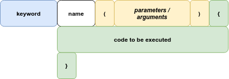

- [Variables](#variables)
  - [Declaration](#declaration)
  - [Scope](#scope)
  - [Objects](#objects)
    - [Accessing Object Properties](#accessing-object-properties)
    - [Object Methods](#object-methods)
    - [The 'this' keyword](#the-this-keyword)
  - [Arrays](#arrays)
    - [Looping Array Elements](#looping-array-elements)
  - [The Difference Between Arrays and Objects](#the-difference-between-arrays-and-objects)
- [HTML Events](#html-events)
- [Functions](#functions)
  - [Syntax](#syntax)
- [Sources](#sources)

---
# Introduction
---

JavaScript can "display" data in different ways:
- Writing into an HTML element (`document.getElementById()`)
- Writing into the HTML output (`document.write()`)
- Writing into an alert box (`window.alert()`)
- Writing into the browser console (`console.log()`)

# Variables

## Declaration

There are 3 ways to declare a JavaScript variable:

| Type    | Scope             | Can be redeclared? | Can be reassigned? | Hoisting Behaviour         |
| :------ | :---------------- | :----------------- | :----------------- | :------------------------- |
| `var`   | global & function | yes                | yes                | initialized with undefined |
| `let`   | block             | no                 | yes                | uninitialized              |
| `const` | block             | no                 | no                 | uninitialized              |

**Important:** `const` doesn't define a constant value, it defines a *constant reference* to a value, array or object. That means it can't be reassigned, but *it can be changed*.

```js
const cars = ["Saab", "Volvo", "BMW"];

// can't be reassigned
cars = ["Toyota", "Volvo", "Audi"]; // ERROR

// but the values can be changed
cars[0] = "Toyota";
```

## Scope

| Type       | Definition                                                                       |
| :--------- | :------------------------------------------------------------------------------- |
| `Global`   | Can be accessed from anywhere (e.g. JS document).                                |
| `Local`    | Variables in a function scope or block scope are local.                          |
| `Lexical`  | A child scope has access to data in its parent's scope (e.g. nested functions).  |
| `Block`    | Variables declared inside a { } block cannot be accessed from outside the block. |
| `Function` | The variables declared in a function is accessible in that local scope.          |

## Objects

JavaScript objects are containers for **named values** called properties.

### Accessing Object Properties

Object values are written as *name:value* pairs. They can be accessed in two ways:

`objectName.propertyName` or `objectName["propertyName"]`

### Object Methods

Methods are **actions** that can be performed on objects.

Methods are stored in properties as **function definitions**.

Example:

```js
const person = {
  firstName: "John",
  lastName : "Doe",
  fullName : function() {
    return this.firstName + " " + this.lastName;
  }
};
```
### The 'this' keyword
In a function definition, this refers to the "owner" of the function.

In the example above, this is the **person object** that "owns" the fullName function.

## Arrays

JavaScript variables can be objects. Arrays are special kinds of objects.

You can have objects in an Array. You can have functions in an Array. You can have arrays in an Array.

### Looping Array Elements

Arrays can be looped using either a `for` loop:

```js
const fruits = ["Banana", "Orange", "Apple", "Mango"];
let fLen = fruits.length;

text = "<ul>";
for (let i = 0; i < fLen; i++) {
  text += "<li>" + fruits[i] + "</li>";
}
text += "</ul>";
```
or the `Array.forEach()` function:

```js
const fruits = ["Banana", "Orange", "Apple", "Mango"];

let text = "<ul>";
fruits.forEach(myFunction);
text += "</ul>";

function myFunction(value) {
  text += "<li>" + value + "</li>";
}
```

## The Difference Between Arrays and Objects
In JavaScript, arrays use numbered indexes.  

In JavaScript, objects use named indexes.

Warning: When using named indexes in arrays, some array methods and properties will produce incorrect results.

```js
const person = [];
person["firstName"] = "John";
person["lastName"] = "Doe";
person["age"] = 46;
person.length;     // Will return 0
person[0];         // Will return undefined
```

# HTML Events
HTML events are "things" that happen to HTML elements.

When JavaScript is used in HTML pages, JavaScript can "react" on these events.

Example:
```js
<button onclick="this.innerHTML = Date()">The time is?</button>
```

| Event          | Definition                                          |
| :------------- | :-------------------------------------------------- |
| `onchange`     | An HTML element has been changed.                   |
| `onclick`      | The User clicks an HTML element.                    |
| `onmousehover` | The user moves the mouse over an HTML element.      |
| `onmouseout`   | The user moves the mouse away from an HTML element. |
| `onkeydown`    | The user pushes a keyboard key.                     |
| `onload`       | The browser has finished loading the page.          |

There are many more events, a full list [here](https://www.w3schools.com/jsref/dom_obj_event.asp).


# Functions

A JavaScript function is a block of code designed to perform a task.

## Syntax

A JS function is defined by the function *keyword*, followed by a **name**, followed by parentheses **()**.

- **Parameters** are listed inside the parentheses () in the function definition..
- **Arguments** are the values received by the function when it is invoked.
- The **code to be executed** by the function is placed inside curly brackets.



**Important:** Inside the function, the arguments (the parameters) behave as local variables.


# Sources

- [W3 Schools](https://www.w3schools.com/js)
- [Programming with Mosh](https://www.youtube.com/watch?v=W6NZfCO5SIk)